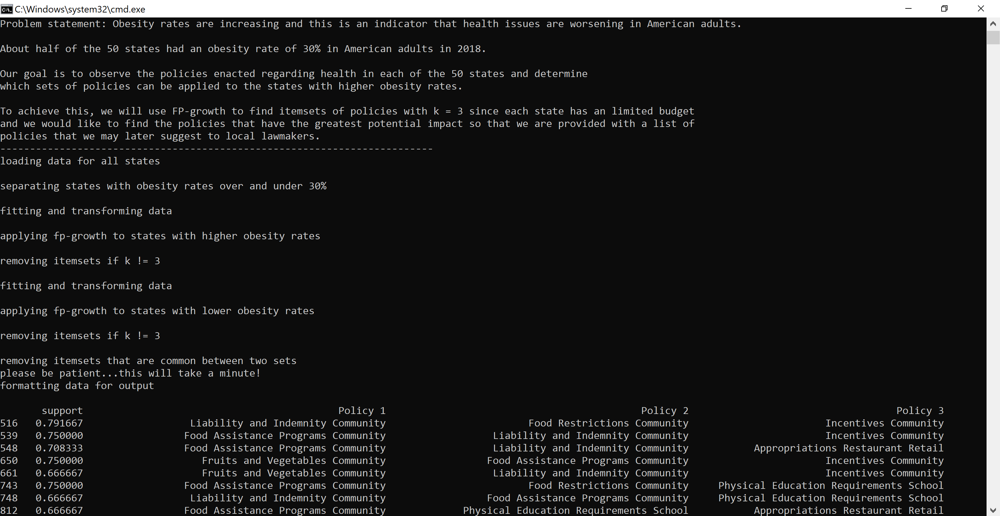
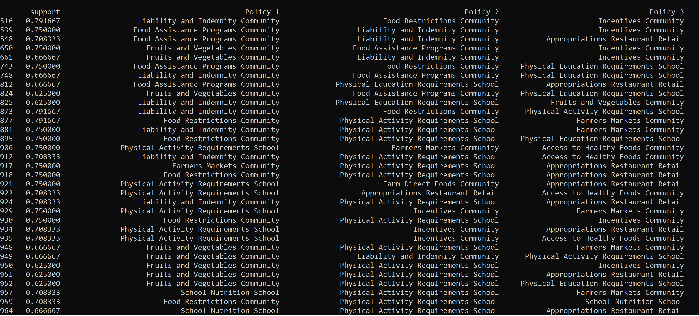

# Preventing Obesity Through Policy Selection
Addressing the obesity epidemic remains imperative for ensuring the health of the nation. Through data mining, we can determine what combination of policies have worked in the past in order to lower obesity rates in higher-risk states. 

## Obesity: a common, serious, and costly disease
According to the CDC:
* The prevalence of obesity was 42.4% in 2017~2018.
* From 1999–2000 through 2017–2018, the prevalence of obesity increased from 30.5% to 42.4%, and the prevalence of severe obesity increased from 4.7% to 9.2%. 
* Obesity-related conditions include heart disease, stroke, type 2 diabetes and certain types of cancer that are some of the leading causes of preventable, premature death.
* The estimated annual medical cost of obesity in the United States was $147 billion in 2008 US dollars; the medical cost for people who have obesity was $1,429 higher than those of normal weight. 

[Source](https://www.cdc.gov/obesity/data/adult.html): Adult Obesity Facts, 2020

Although this is a health epidemic occuring all across America, this is impacting certain states more than others. About half of the states that make up the U.S.A. had an obesity rate of 30% in American adults in 2018. However, the process of establishing and implementing new laws is a costly endeavor and state budgets are limited-- thus decision-makers must prioritize legislation that is more likely to have a significant impact on fighting obesity and lowering these rates. Therefore, by using data mining, we can aid lawmakers in narrowing down their options.

## The Project
### Objective
In this project, the Frequent-Pattern (FP) Growth algorithm is applied to the [CDC Nutrition, Physical Activity, and Obesity - Legislation](https://chronicdata.cdc.gov/Nutrition-Physical-Activity-and-Obesity/CDC-Nutrition-Physical-Activity-and-Obesity-Legisl/nxst-x9p4) multiclass dataset after processing and transforming the data to create a binary classification problem.

### Running the Program
On Windows, you can run `start_program.bat`, which will create the Python virtual environment, install all dependencies and run the Python program.

### Screenshots

#### Performing FP-Growth on Dataset

#### Final Output

